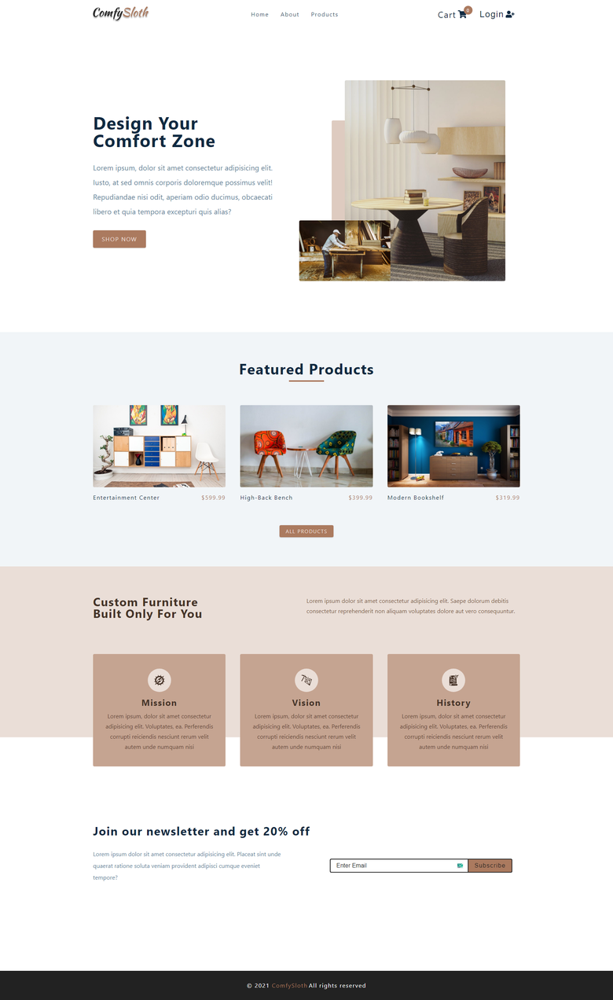

# comfy_store
A front-end web store written in the mother of all languages, JS. Faraway of front-end modern technologies that will not end :) Now you can you get on the best room offers that you'll ever need, all that just from one place, comphy_store.

## Built with
- HTML5
- CSS3
- JS (OOP, JSON, ASYNC await);
- Redux;
- Tailwindcss;
- Jest;
- Webpack

## Project Learning Goals

- JS: Using the mother of all languages, JS, confidently without prefering the modern techologies.
- Redux: mother of managing app state in a predictable way.
- Webpack: Using the heart of modren techologies and tools nowdays.

## Preview

[Comfy Rooms App](https://morning-wave-69516.herokuapp.com/)
